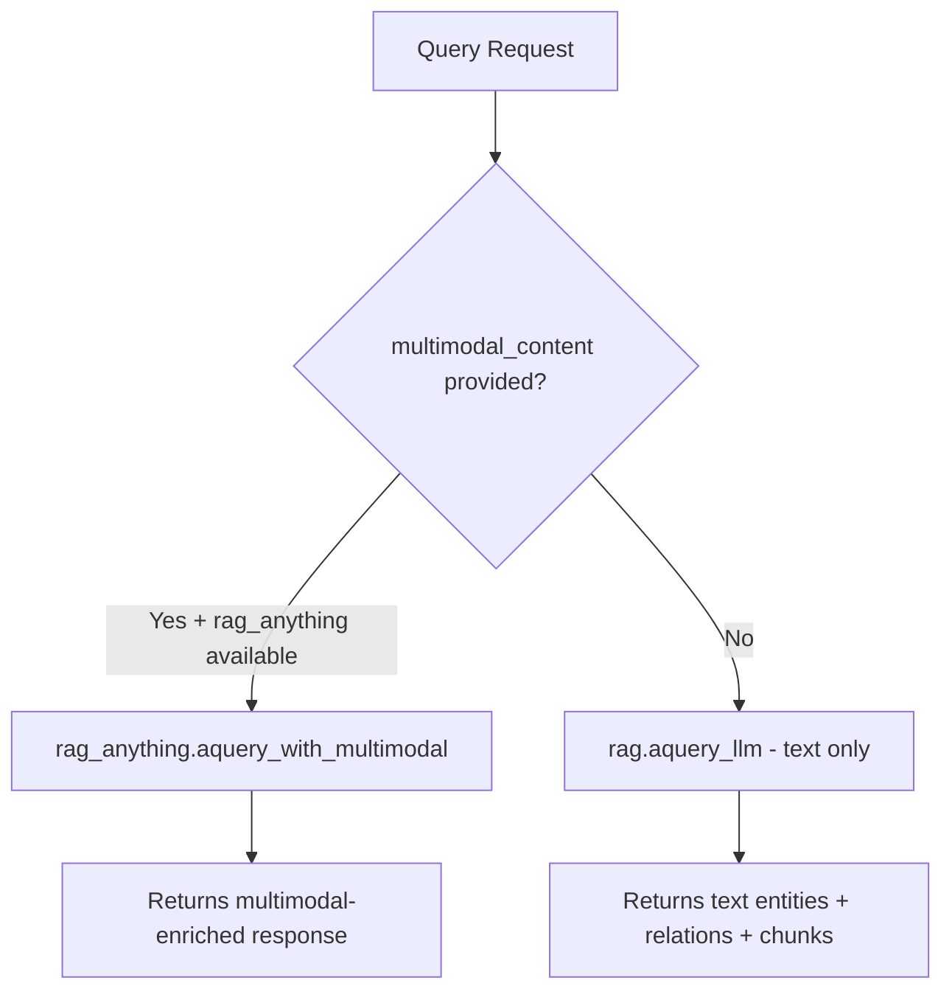
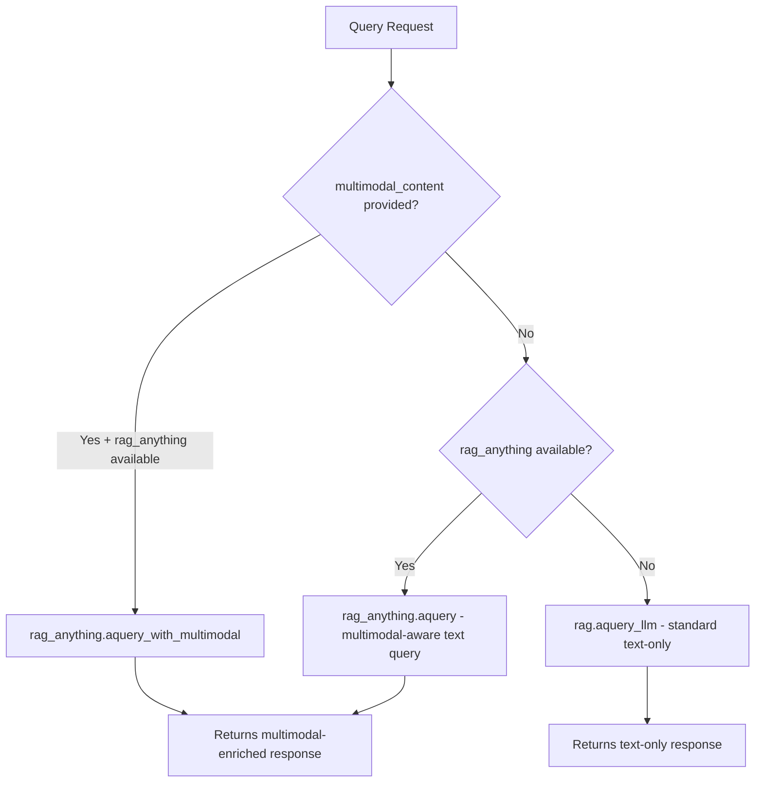

# Plan: Route All Queries Through RAGAnything When Multimodal Is Enabled

## Problem

When documents are ingested via RAGAnything (multimodal pipeline), the retrieval phase only returns text information about images/tables/equations — not the actual multimodal content. This is because the standard query path uses `rag.aquery_llm()` (LightRAG), which only retrieves text entities, relations, and chunks from the knowledge graph.

RAGAnything's `aquery()` method wraps LightRAG's query but enriches the response with multimodal content (images, tables, equations) that were stored during document processing. When `rag_anything` is available, ALL queries — even plain text queries without `multimodal_content` — should route through `rag_anything.aquery()` so that multimodal context is included in responses.

## Current Flow



**Problem**: Path D never uses RAGAnything, so multimodal content ingested via RAGAnything is lost during retrieval.

## Proposed Flow



## Scope — Only modify `lightrag/api/routers/query_routes.py`

## Interface Differences

| Method | Returns | Streaming | References |
|--------|---------|-----------|------------|
| `rag.aquery_llm()` | `dict` with `data`, `llm_response`, `metadata` | Yes, via `response_iterator` | Yes, in `data.references` |
| `rag_anything.aquery()` | `str` - plain text response | No - returns complete string | No - not included |
| `rag_anything.aquery_with_multimodal()` | `str` - plain text response | No - returns complete string | No - not included |

**Key challenge**: `rag_anything.aquery()` returns a simple string, while the API endpoints expect the structured dict format from `rag.aquery_llm()`. We need to wrap the RAGAnything response in the expected format.

## Changes Required

### 1. `/query` endpoint — `query_text()` function (around line 416)

**Current**: Only routes to `rag_anything` when `request.multimodal_content` is provided. Otherwise always uses `rag.aquery_llm()`.

**Change**: After the multimodal_content check, add a new branch: when `rag_anything is not None` and no `multimodal_content`, use `rag_anything.aquery()` instead of `rag.aquery_llm()`.

```python
# After the existing multimodal_content checks...

# When rag_anything is available, use it for ALL queries
# (even plain text) to get multimodal-enriched responses
if rag_anything is not None:
    try:
        result = await rag_anything.aquery(
            request.query,
            mode=request.mode,
        )
        # rag_anything.aquery() returns a string
        if request.include_references:
            return QueryResponse(response=result, references=[])
        return QueryResponse(response=result, references=None)
    except Exception as e:
        logger.error(f"RAGAnything query failed, falling back to standard: {e}")
        # Fall through to standard query path

# Standard text-only query path (existing code unchanged)
param = request.to_query_params(False)
...
```

### 2. `/query/stream` endpoint — `query_text_stream()` function (around line 704)

**Current**: Same pattern — only routes to `rag_anything` when `multimodal_content` is provided.

**Change**: Same pattern as `/query` — when `rag_anything is not None`, use `rag_anything.aquery()` and wrap the result in a streaming response format.

```python
# After the existing multimodal_content checks...

if rag_anything is not None:
    try:
        result = await rag_anything.aquery(
            request.query,
            mode=request.mode,
        )
        # Wrap string result in streaming format
        async def rag_anything_stream():
            if request.include_references:
                yield json.dumps({"references": []}) + "\n"
            yield json.dumps({"response": result}) + "\n"

        return StreamingResponse(
            rag_anything_stream(),
            media_type="application/x-ndjson",
        )
    except Exception as e:
        logger.error(f"RAGAnything query failed, falling back to standard: {e}")
        # Fall through to standard query path
```

### 3. `/query/data` endpoint — `query_text_data()` function (around line 1216)

**Decision**: This endpoint returns structured retrieval data (entities, relationships, chunks) without LLM generation. RAGAnything's `aquery()` doesn't provide this structured data format. This endpoint should continue using `rag.aquery_data()` as-is, since its purpose is to expose raw retrieval data, not LLM-generated responses.

**No changes needed** for `/query/data`.

## Important Design Decisions

1. **Fallback behavior**: If `rag_anything.aquery()` fails, we should fall through to the standard `rag.aquery_llm()` path rather than returning an error. This ensures robustness.

2. **References**: `rag_anything.aquery()` doesn't return references. We return an empty references list when `include_references=True`. This is consistent with how `aquery_with_multimodal` already handles references.

3. **Streaming**: `rag_anything.aquery()` returns a complete string, not a stream. For the streaming endpoint, we wrap the complete response in a single-chunk stream. This is the same approach used for `aquery_with_multimodal`.

4. **QueryParam forwarding**: We should pass relevant query parameters (mode, top_k, etc.) to `rag_anything.aquery()` if it supports them. From the example, it accepts at least `mode`.

5. **No changes to `/query/data`**: This endpoint serves a different purpose (raw data retrieval) and should continue using the standard LightRAG path.

## Files Modified

- `lightrag/api/routers/query_routes.py` — Only file modified

## Testing

1. With `ENABLE_MULTIMODAL=false`: All queries should work exactly as before (no regression)
2. With `ENABLE_MULTIMODAL=true` + text query: Should route through `rag_anything.aquery()` and return multimodal-enriched responses
3. With `ENABLE_MULTIMODAL=true` + multimodal_content: Should continue using `rag_anything.aquery_with_multimodal()` (existing behavior)
4. With `ENABLE_MULTIMODAL=true` + RAGAnything failure: Should fall back to standard `rag.aquery_llm()`
